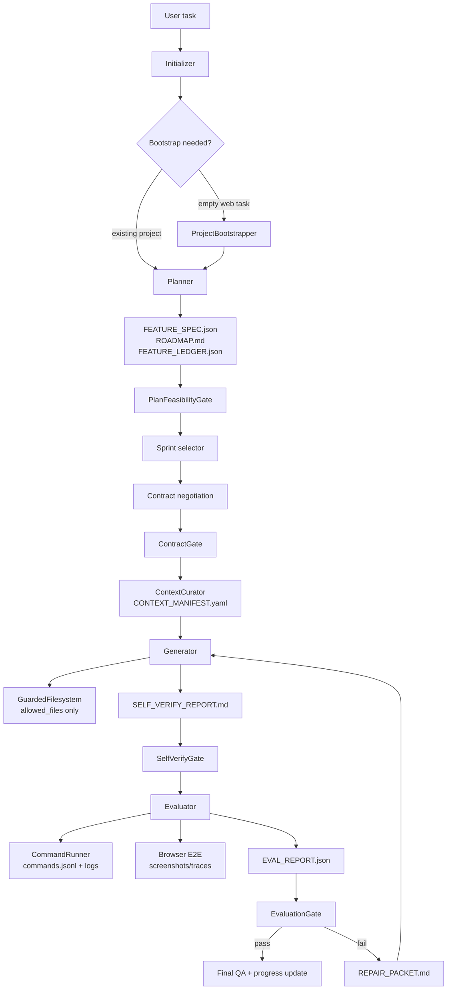

# OpenJIA

OpenJIA is a harness system for long-running software development agents. It is built around a planner-generator-evaluator loop, with artifact-gated execution, scoped context, external evaluation, repair packets, and durable progress state.

The current implementation can run a short task through a minimal end-to-end flow: bootstrap a generic web runtime, plan scoped work, generate files, run self-verification, execute browser checks, write evidence, and update harness artifacts.

## Architecture



## Core Ideas

- Planner creates a verifiable feature spec, not vague prose.
- Generator can only write contract-approved files.
- Self-verification is required but not trusted as final proof.
- Evaluator independently runs commands and browser checks.
- Success only comes from `EVAL_REPORT.json.overall_status == "pass"`.
- `.harness/` is the system of record for every run.

See:

- [docs/HARNESS_DESIGN_PRINCIPLES.md](docs/HARNESS_DESIGN_PRINCIPLES.md)
- [docs/END_TO_END_EXECUTION_PLAN.md](docs/END_TO_END_EXECUTION_PLAN.md)
- [docs/HARNESS_IMPROVEMENT_PLAN.md](docs/HARNESS_IMPROVEMENT_PLAN.md)

## Installation

```powershell
cd d:\Project\OpenJIA
pip install -e ".[llm]"
```

The `llm` extra installs the OpenAI Python SDK used for OpenAI-compatible providers such as MiniMax.

## Secrets

Use `.env` for real API keys. It is ignored by git.

```env
MINIMAX_API_KEY=your_minimax_api_key_here
MINIMAX_BASE_URL=https://api.minimaxi.com/v1
OPENJIA_LLM_BACKEND=minimax
OPENJIA_LLM_MODEL=MiniMax-M2.7
```

Commit `.env.example`, never `.env`.

## Quick Checks

```powershell
openjia llm-smoke --llm-backend minimax --model MiniMax-M2.7
openjia llm-smoke --llm-backend deepagents --model MiniMax-M2.7
pytest -q
```

## Usage

Initialize only:

```powershell
openjia init .
```

Plan only:

```powershell
openjia plan "Build a small portfolio website" . --llm-backend minimax --model MiniMax-M2.7
```

Run the current end-to-end web flow:

```powershell
$target = "$env:TEMP\openjia-demo-site"
New-Item -ItemType Directory -Force $target
openjia run "Build a small portfolio website with a projects section and contact call to action" $target --llm-backend deepagents --model MiniMax-M2.7 --max-sprints 1
```

Run the generated app:

```powershell
cd $target
npm run dev
```

Then open:

```text
http://localhost:5173
```

## Current Capabilities

- MiniMax/OpenAI-compatible LLM planner.
- DeepAgents SDK runtime backend via `--llm-backend deepagents`.
- LLM generator interface with structured file outputs.
- Generic deterministic fallback for simple static web scaffolds.
- Guarded file writes constrained by `CONTRACT.yaml`.
- Feature ledger and progress tracking.
- Command logs under `.harness/logs/commands.jsonl`.
- Browser smoke verification and generic CRUD interaction probes when the page exposes matching controls.
- Evidence such as `test-results/page-smoke.html` and `test-results/crud-interactions.txt`.

## Current Limits

- General-purpose LLM generation is still early and should be treated as experimental.
- Repair loop fingerprints and RCA escalation are not fully implemented yet.
- Final run report and persistent dev server URL output still need improvement.
- DeepAgents SDK runtime is available for structured Planner/Generator calls, but direct DeepAgents tool-use integration is still evolving.

## Development Rule

After every implementation pass:

1. Run tests.
2. Run any relevant smoke checks.
3. Append the result to [CHANGELOG.md](CHANGELOG.md).
